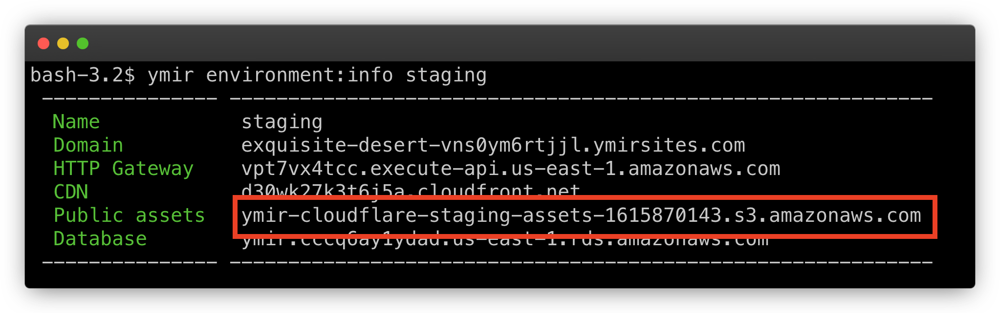
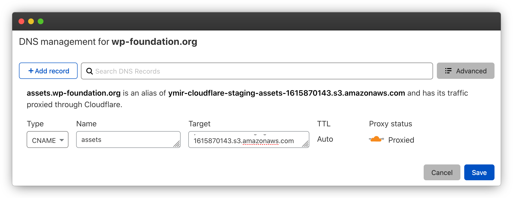
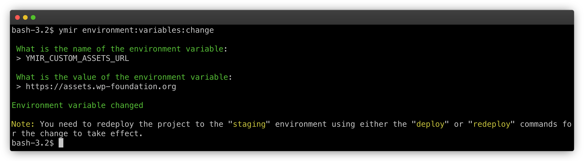

## Serving project assets with Cloudflare

If you've disabled CloudFront completely by setting `caching` to `disabled`, it's recommended to use Cloudflare to serve your assets instead of S3. To do this, you'll need to create a DNS record that points to your S3 bucket. You can get the domain of the S3 bucket using the `environment:info` command.

Next, you want to create a `CNAME` DNS record pointing to the S3 bucket in Cloudflare. For this guide, we'll use `assets.wp-foundation.org`.

Finally, you want to add the `YMIR_CUSTOM_ASSETS_URL` environment variable to your environment. That environment variable needs to point to the domain that Cloudflare will serve assets from. To add the environment variable, you can use the ` environment:variables:change` command.

::: warning scheme required
You must ensure to put the `https://` when adding the `YMIR_CUSTOM_ASSETS_URL` environment variable.
:::

