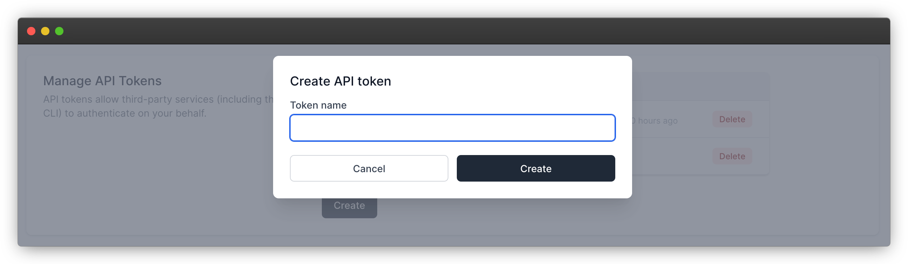

# Automating your deployments

[[toc]]

## Why automate your deployment?

In practice, it's not ideal to deploy your projects from your local development environment. That's because the Ymir CLI will package all the files in your WordPress project including uncommited files. This isn't something that you might want especially when deploying to production.

In this scenario, you might want to look at automating your deployment. Ymir makes it easy for you to deploy your project using your favourite continuous integration platform.

## Creating an API token

All that you need is an API token. To create one, go to the [account management page][1] and scroll down to the **Manage API Tokens** section.



The Ymir CLI will look for the `YMIR_API_TOKEN` environment variable. So, once the API token created, you'll need to add it as an environment variable in your continuous integration workflow.

## Continuous integration platforms

Thew following section explains how to set up a basic automated deployment workflow with different continuous integration platforms.

### GitHub actions

First, you're going to need to create a secret to store your API token. Secrets are encrypted environment variables that allow you to store sensitive information safely. You can read more about them and how to create them [here][2].

You can name your secret whatever you want. That said, for this example, the secret name will be `YMIR_API_TOKEN` like the environment variable. You can see it in the same workflow below.

```yml
name: Deploy to production

on:
  push:
    branches:
      - main

jobs:
  deploy:
    name: Deploy to production
    runs-on: ubuntu-latest
    steps:
      - uses: actions/checkout@v2
      - name: Setup PHP
        uses: shivammathur/setup-php@v2
        with:
          php-version: '7.4'
      - name: Install Ymir CLI
        run: composer global require ymirapp/cli
      - name: Deploy
        run: ymir deploy production
        env:
          YMIR_API_TOKEN: ${{ secrets.YMIR_API_TOKEN }}
```

This sample workflow will deploy your project to `production` whenever a commit gets pushed to the `main` branch. You'll want to use `master` branch if you have an older GitHub repository.

### Bitbucket Pipelines

First, you're going to need to create a secret to store your API token as the `YMIR_API_TOKEN` environment variable. Secrets are encrypted environment variables that allow you to store sensitive information safely. You can read more about them and how to create them [here][3].

```yml
pipelines:
  branches:
    main:
      - step:
          name: Deploy to production
          image: php:7.4.33
          script:
            - apt-get update && apt-get install --yes zip unzip libzip-dev
            - docker-php-ext-install zip
            - docker-php-ext-enable zip
            - curl -sS https://getcomposer.org/installer | php -- --install-dir=/usr/local/bin --filename=composer
            - composer global require ymirapp/cli
            - composer install
            - export PATH="$PATH:$HOME/.composer/vendor/bin"
            - source ~/.bashrc
            - ymir deploy production
```

This sample pipeline will deploy your project to `production` whenever a commit gets pushed to the `main` branch.

[1]: https://ymirapp.com/account/manage
[2]: https://docs.github.com/en/free-pro-team@latest/actions/reference/encrypted-secrets
[3]: https://support.atlassian.com/bitbucket-cloud/docs/variables-and-secrets/
