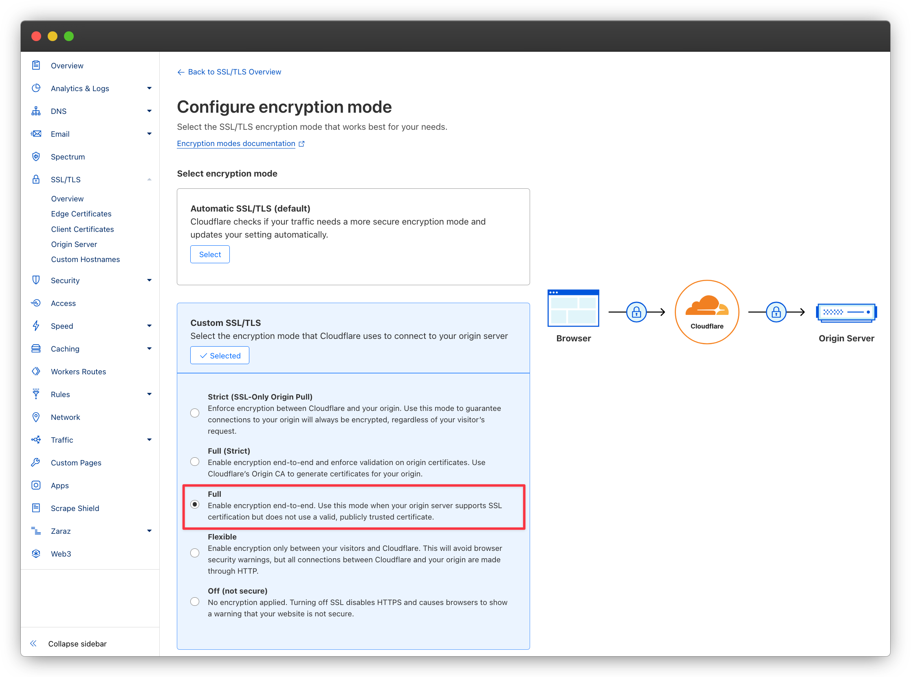
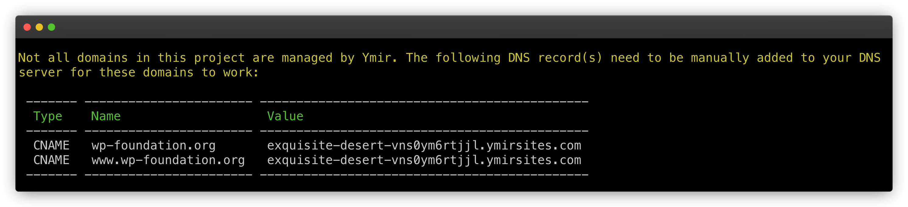
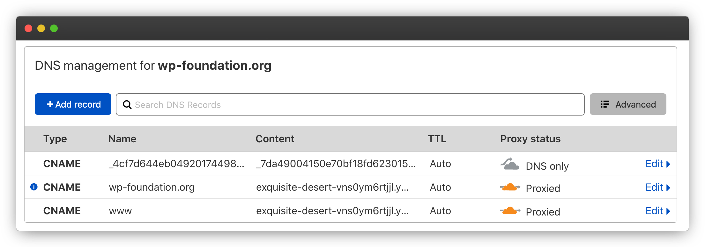
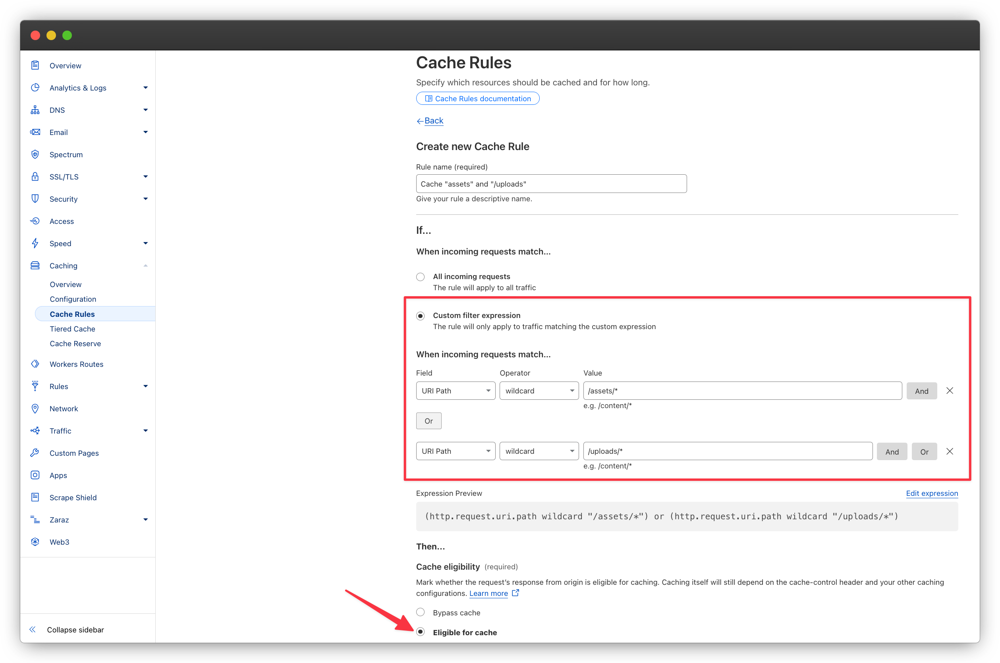

# Using Cloudflare as a content delivery network

[[toc]]

## Why use Cloudflare?

While Ymir already comes with CloudFront as a content delivery network, you're not required to use it if you don't want to. You can disable CloudFront using the [`cdn`][1] project configuration option. But you can also use another content delivery network like [Cloudflare][2].

Cloudflare is a popular content delivery network option because of its generous free tier. It also has advanced features such as [Cloudflare workers][3], which CloudFront doesn't have. Cloudflare also doesn't have any bandwidth costs which can reduce your Cloudfront costs in high traffic scenarios.

## Prerequisites

To use Cloudflare as content delivery network, you need to have the following prerequisites met.

### Domain name

You must have a domain name you can use with Cloudflare to point to your Ymir project to. This domain will have to be managed by Cloudflare.

::: warning Cannot use vanity domain
You cannot use Cloudflare or other content delivery networks with the `ymirsites.com` vanity domain.
:::

### SSL certificate

Since you cannot have Ymir manage the domain used with Cloudflare, you must ensure to first create a SSL certificate for that domain using the `certificate:request` command.

::: warning Disable proxy
When adding your SSL certificate DNS validation record, make sure to disable the Cloudlfare proxy by setting it to `DNS only`.
:::

### SSL encryption mode

In Cloudflare, you must ensure to set the encryption level to `Full` for the domain that you'll use.



## Configuring your project

Now, we can start by changing our project configuration.

### Adding your domain

The main thing you need to do is to add the domain managed by Cloudflare as the domain for your project. For this guide, that domain will be `wp-foundation.org`. (It's just one of the many domains I own lol) Here's a partial `ymir.yml` project configuration file with the domain set for the `staging` environment:

```yml
environments:
  staging:
    domain: wp-foundation.org
```

### Content delivery network configuration

You can use Cloudflare with any `cdn` project setting. If you use it with `caching` set to `enabled`, Cloudflare will act as a content delivery network on top of CloudFront. If you set it to `assets`, you can have Cloudflare cache your pages while assets get served by CloudFront. Or if it's `disabled`, Cloudflare will cache your pages, but S3 will serve your your assets.

::: danger Cannot serve project assets with Cloudflare
It's currently not possible to serve your project assets due to how [customizing a S3 bucket domain name work][4].
:::

## Deploying your project

Next, you'll want to deploy your project. Once the project deployed, the Ymir CLI will display a warning with DNS records to add.



## Adding DNS records to Cloudflare

You'll then want to add these DNS records to Cloudflare like this:



## Creating Cloudflare caching rule for assets and uploads

If you decide to use Cloudflare as your content delivery network on top of CloudFront, you'll need to configure [cache rules][5] to cache assets and uploads. To do that, you'll need to head to the Cloudflare dashboard and create a cache rule there. (You can read more on how to create a cache rule in the Cloudflare dashboard [here][6].)

Below, you'll find the cache rule to use to cache both your assets and uploads.



The resulting expression should be:

```
(http.request.uri.path wildcard "/assets/*") or (http.request.uri.path wildcard "/uploads/*")
```

You must then select **Eligible for cache** as the caching option. You may use the default values for all the other options.

## Configuring WordPress to have the correct remote address

When using Cloudflare, WordPress will be unable to detect the proper IP address for HTTP requests. `REMOTE_ADDR` will always be pointing to a Cloudflare IP address. This is a problem when tracking IPs for spam, bot detection or any other security scenarios.

To update `REMOTE_ADDR` to have the proper request IP address, add the following to your `wp-config.php`:

```php
if (!empty($_SERVER['HTTP_CF_CONNECTING_IP'])) {
    $_SERVER['REMOTE_ADDR'] = $_SERVER['HTTP_CF_CONNECTING_IP'];
}
```

This will replace `REMOTE_ADDR` with the IP address that Cloudflare received the request from.

[1]: ../reference/configuration.md#cdn
[2]: https://cloudflare.com
[3]: https://workers.cloudflare.com/
[4]: http://docs.aws.amazon.com/AmazonS3/latest/dev/VirtualHosting.html#VirtualHostingCustomURLs
[5]: https://developers.cloudflare.com/cache/how-to/cache-rules/
[6]: https://developers.cloudflare.com/cache/how-to/cache-rules/create-dashboard/
