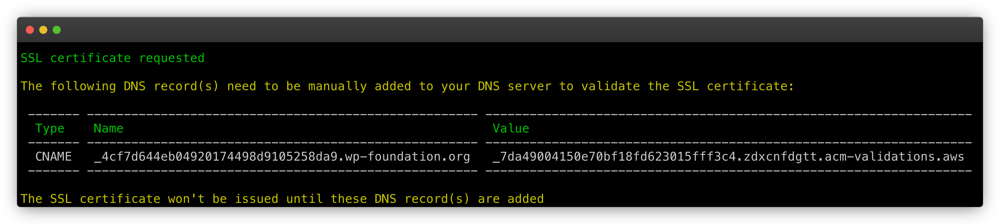
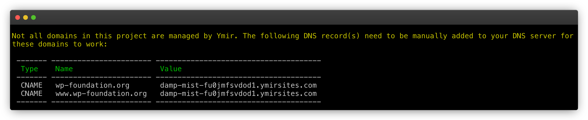

# How to map a domain to a project environment

[[toc]]

## Why do you need to map a domain to an environment?

Ymir generates a unique `ymirsites.com` [vanity domain][1] for all project environments. This allows you to always have access to your environment. That said, there are some drawbacks to only using a vanity domain.

First, you can't send emails when only using a vanity domain. Your site also won't be indexed by search engines. And, of course, you don't want to use a vanity domain for a production environment.

So while having a vanity domain is useful, you'll want to use your own domain for your project environment pretty quickly.

## DNS requirements

One important consideration when mapping a domain to a project environment is whether Ymir is managing the DNS for that domain or not. If it is, you can skip this section since Ymir will take care of creating and updating all relevant DNS records. If Ymir isn't managing your domain's DNS server, you'll want to read the rest of this section.

### Requesting a SSL certificate

Each domain that you want to map needs to have a valid [SSL certificate][4] before you're allowed to deploy. You'll need to use the [`certificate:request`][2] command to request one for each registered domain that you want to map to your environment. So, for example, if you want to map your project environment to `domain.co.uk` and `subsite.domain.co.uk`, you only need to request a SSL certificate for `domain.co.uk`.



Once you request a SSL certificate, the Ymir CLI will let you know what DNS record you need to add so that AWS can issue the certificate. You can see an example of the Ymir CLI output for the `wp-foundation.org` domain above. It's important to note that **you won't be able to deploy until AWS issues your SSL certificate**.

### Creating a DNS record pointing to the project environment

You'll also need to create a DNS record to point to the deployed project environment. The Ymir CLI will tell what DNS record to add once the deployment finishes. You can see an example for the `wp-foundation.org` domain below. You only need to do this once unless you add or remove domains from your `ymir.yml` project configuration file.



## Adding domains to your configuration

Once the DNS requirements are met, you simply need to add the [`domain`][3] option to your `ymir.yml` configuration file with the domain(s) that you want to map your environment to. Once that's done, you simply need to deploy your environment.

### Mapping a single domain

If you're looking to map to a single domain, you can use the `domain` option like this:

```yml
id: 1
name: project-name
type: wordpress
environments:
  environment-name:
      domain: domain.co.uk
```

::: tip No www subdomain needed
If you use a registered domain (such as `domain.co.uk`) as your `domain` value, Ymir will automatically map the `www` subdomain to your environment. This also works in reverse. If you use `www.domain.co.uk` as your `domain` value, Ymir will also map `domain.co.uk` to your environment.
:::

## Mapping multiple domains

If you're looking to map multiple domains, you can use the `domain` option like this:

```yml
id: 1
name: project-name
type: wordpress
environments:
  environment-name:
      domain:
        - domain.co.uk
        - www.domain.co.uk
        - subdomain.co.uk
```

You'll notice that, with this configuration, you need to add the `www.domain.co.uk` domain. Ymir won't automatically handle it for you.

::: warning Mapped domain limit
You cannot have more than 99 domain names mapped per environment. If you need to map more 99 domains, consider using a wildcard domain or creating additional environments.
:::

## Wildcard domains

Ymir also supports wildcard domains. For the purpose of the domain mapping limit, a wildcard domain only counts as a single domain mapping even if it could support hundreds of domains. To map a wildcard domain, you can do the following:

```yml
id: 1
name: project-name
type: wordpress
environments:
  environment-name:
      domain:
        - domain.co.uk
        - '*.domain.co.uk'
```

You'll still need to map the `domain.co.uk` top level domain with a wildcard domain.

::: warning Use single quotes for wildcard domain
A wildcard domain mapping must be wrapped in single quotes for proper parsing of the YAML file.
:::

[1]: ../projects/environments.md#vanity-domain-name
[2]: ../reference/ymir-cli.md#certificate-request
[3]: ../reference/configuration.md#domain
[4]: ../team-resources/ssl-certificates.html
