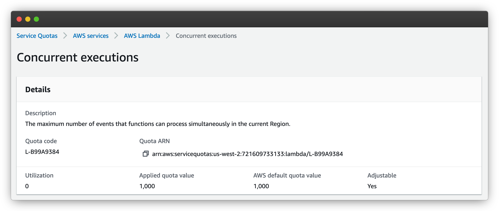
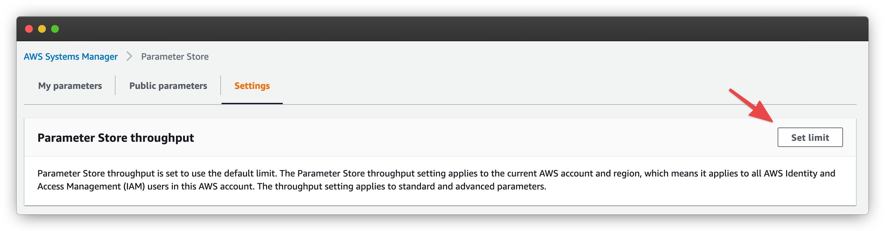

# How to configure your environment for Lambda scaling

[[toc]]

## When do you need to worry about Lambda scaling?

First, not every situation requires that you worry about Lambda scaling. That's because Ymir uses CloudFront to do page caching. This is the default setting for production environments unless you changed the [`caching`][1] option.

CloudFront can handle hundreds of thousands of request per minute. These requests never reach Lambda which means you don’t need to worry about Lambda scaling. That's why, if your WordPress site only needs page caching, you should be fine with using CloudFront with Ymir's default settings.

That said, we can't solve every scaling situation with page caching. For example, [WooCommerce][2] has carts which you can’t cache using page caching. This means that all requests to a cart or anyone with a non-empty cart won't have their requests cached and they'll hit Lambda. So to handle thousands of customers shopping on a WooCommerce site, you need your environment to scale to thousands of concurrent Lambdas.

It's in a situation such as this that you have to worry about Lambda scaling.

## How does Lambda scaling work?

AWS Lambda automatically scales based on the number of incoming requests your environment is receiving. At the heart of Lambda's scaling capability is the concept of concurrency, which refers to the number of concurrent Lambdas that are simultaneously processing these requests. A simple way to imagine concurrency is to think of it as the current number of PHP workers. 

As your environment receives more and more traffic, AWS Lambda will continue to increase the number of Lambdas processing these requests until it reaches your environment's concurrency limit. (Controlled with the [`concurrency`][3] option.) This concurrency limit is the same as setting the maximum number of PHP workers your environment can have.

AWS also has a concurrency limit for your account. By default, that concurrency limit is 1000 **per region**. This means that you can only assign a total of 1000 `concurrency` across all your environments for a region. (You'll see how to increase that you account limit further into the guide.)

The final aspect of Lambda scalling is the idea of concurrency scaling rate. This is refers to how fast Lambda can increase your concurrency limit over time. This scaling rate is 1,000 concurrent Lambdas per 10 seconds. This means that, if you have an environment using 1,000 Lambdas concurrently, AWS will be able to increase that limit to 2,000 after 10 seconds. And then if you reach 2,000 concurrent Lambdas, it'll increase the limit to 3,000 after 10 seconds. 

This concurrency scaling is **per environment** and not account wide. So, as long as your account limit is high enough, you could have more than one environment scaling to thousands of Lambdas in seconds at the same time. This concurrency scaling is sufficient for most use cases.

For more detailed explanations, visit the AWS documentation on [Lambda function scaling documentation][4] and [Lambda scaling behavior][5].

## Changes to your AWS account

Next, you'll need to make some changes to your AWS account to support a high level of Lambda scaling. It's important to note that **these changes need to be done in each region where you want to use a high level of Lambda scaling**. So, if you have one project in `eu-west-1` and another in `us-east-1`, you need to apply these changes to both regions.

### Raise your account concurrency limit

If you want to have a concurrency limit larger than 1,000 Lambda, you'll need to raise the concurrent execution limit. To increase that limit, you need to request a quota increase which you can do [here][6].

The request might take a few days, and AWS support might ask you a few questions. If you're not sure how to answer any of them, you can [contact Ymir support][7] and we'll help you.

### Increase your parameter store throughput

Another change that you'll need to do is increase the throughput of the parameter store. The parameter store is where Ymir stores the [secrets][8] used by your project. These secrets get loaded into your Lambda function during the cold start.

Whenever Lambda spins up hundreds of functions in a small amount of time (less than a minute), the parameter store will start throwing rate limit errors. These will slow down the rate that Lambda can spin up new functions. Increasing the throughput will significantly increase how fast Lambda can spin up new functions.

To increase the throughput limit, you want to go to the parameter store [settings page][9]. You want to click on **Set limit**. This will bring up a modal where you have to agree that turning on the setting will incur additional charges.

## Set the concurrency limit in your project configuration

Once your AWS account configured, you'll want to update your `ymir.yml` configuration file with your desired concurrency limit. By default, Ymir sets the limit to 10 concurrent Lambdas.

To change it, you need to change the [`concurrency`][3] option. You can set it to `false` to disable the concurrency limit. That said, this isn't recommended. You should instead set it to a value even if it's quite large.

## Configuring your database server

::: tip Aurora Serverless
If you'd rather not have to have to think about database server connections or database server scaling, you should consider using an [Aurora serverless][11] database cluster. You can create one easily with the [`database:server:create`][12] command.
:::

The reason you don't want to disable the concurrency limit is because of your database server. A database server can only have a certain number of active database connection if you reach that limit, you will start seeing database connection errors. To prevent this, you want to keep your `concurrency` value below the number of maximum connections allowed by your database server.

The number of database connections that a database server can have depends on the type. Ymir supports a lot of different database types. Below is a list of all `t3` instance types with their maximum number of connections.

|Type|Maximum connections|
---|:---:
db.t3.micro|85
db.t3.small|170
db.t3.medium|341
db.t3.large|682
db.t3.xlarge|1365
db.t3.2xlarge|2730

`t3` databases are ideal for most situations. But if you'd like to use another category of database servers, you can refer to [this article][10] to see all maximum connection numbers for all database server types.

[1]: ../reference/configuration.md#caching
[2]: https://woocommerce.com/
[3]: ../reference/configuration.md#concurrency
[4]: https://docs.aws.amazon.com/lambda/latest/dg/invocation-scaling.html
[5]: https://docs.aws.amazon.com/lambda/latest/dg/scaling-behavior.html
[6]: https://console.aws.amazon.com/servicequotas/home/services/lambda/quotas/L-B99A9384
[7]: mailto:support@ymirapp.com
[8]: ../projects/environments.md#secrets
[9]: https://console.aws.amazon.com/systems-manager/parameters/?tab=Settings
[10]: https://sysadminxpert.com/aws-rds-max-connections-limit/
[11]: https://aws.amazon.com/rds/aurora/serverless/
[12]: ../reference/ymir-cli.html#database-server-create
