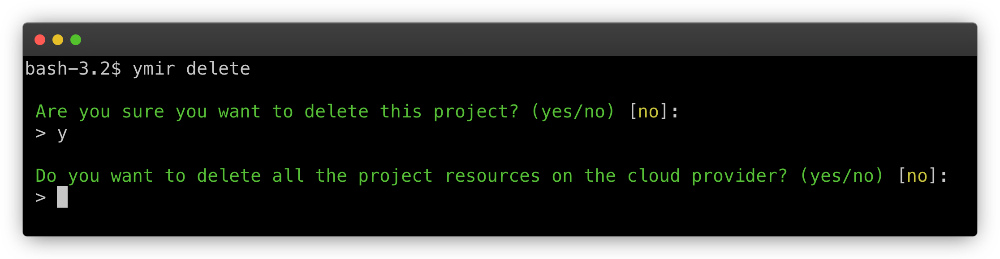

# Managing projects

## Creating a project

You create a Ymir project by executing the `init` command at the root of your WordPress project. If you have multiple AWS accounts connected, the Ymir CLI will ask you to choose an account for your project. It'll also ask you in which AWS region you want your project created in.

::: warning Double check your team
Before creating a project, you should ensure that you're on the correct team. You can use the `team:current` command to view your currently active team. You can switch to a new one using the `team:switch` command.
:::

The [`init`][2] command will also ask you to fill in configuration details for your project such as the name. You’ll also be able to choose a database server and also create databases for your environments. If you don’t already have a database server, you’ll have a chance to create one first and a network if your team doesn’t have one.

## Configuring a project

Once the [`init`][2] command complete, you'll have a `ymir.yml` file at the root of your project. This is the configuration file for your Ymir project. It contains everything that Ymir needs to deploy your project, but also configure your project environments.

::: tip Configuration reference
The `ymir.yml` has dozens of configuration options. You can learn more about them in the [configuration reference][1].
:::

## Deleting a project

You can delete a project by executing the `delete` command at the root of your WordPress project. The command will prompt you to ask if you want to delete all your project's resources on AWS. Project resources are the S3 buckets, API gateways, Lambda functions and CloudFront distributions used by your project. **Team resources such as database servers and networks aren't deleted.**

By default, none of your project's resources will get deleted. If you choose not to delete them, you'll have to do it from the AWS management console yourself. There isn't a way for Ymir to go back and delete these resources.

::: warning You're still paying for these resources
Most project resources don't cost anything when they aren't in use. So keeping them around after you delete a project won't cost you anything. But some resources like S3 buckets will so beware when deleting a project with a lot of media files.
:::

[1]: ../reference/configuration.md
[2]: ../reference/ymir-cli.md##project-init-init
