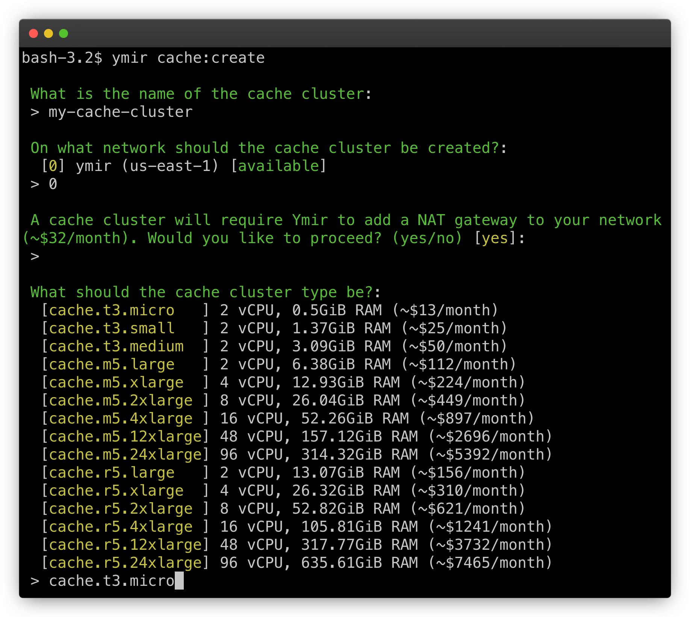

# Caches

## Why do you need a cache?

To have a high performance WordPress site, you often need a persistent [object cache][1]. A persistent object cache stores MySQL query results in a high performance cache. (Usually Memcached or Redis.) Whenever WordPress needs to perform a MySQL query, it'll check the high performance cache before performing the query.

Ymir lets you create and manage Redis cache cluster. You can then use that cluster to power the object cache of multiple WordPress site. For example, a small `t3.micro` cluster can handle hundreds of concurrent requests.

## Managing cache clusters

You can create a cache cluster using the `cache:create` command. The command will prompt you to fill in some details about the cache cluster that you're creating.

::: warning Needs a NAT gateway
Ymir will create a NAT gateway if you create a cache and the network used by the cache doesn't have a NAT gateway already. A NAT gateway costs ~$32/month plus data transfer fees.
:::



If you don't need a cache cluster anymore, you can delete it with the `cache:delete` command.

## Using a cache cluster in a project

Since you can use a cache cluster on multiple projects, you need to configure your project to use one. To do that, you need to update your `ymir.yml` configuration file with the `cache` option. Ymir will then inject the necessary environment variables so that your WordPress site can use the cache cluster.

```yml
id: 1
name: project-name
type: wordpress
environments:
  staging:
    cache: my-cache-cluster
  production:
    cache: my-cache-cluster
```

You'll also need to install an object cache in your WordPress project. You can learn how to do that with [this guide][2].

## Connecting to a cache cluster

Because a cache cluster resides on your network's private subnet, it's not publicly accessible. To connect to it, you'll need to use the [`cache:tunnel`][3] command. This command will create a [SSH tunnel][4] to your [bastion host][5] which allow you to connect to your cache cluster.

Once the tunnel created, you can connect to the cache cluster locally. Below is an example of how to connect using [TablePlus][6].


[1]: https://developer.wordpress.org/reference/classes/wp_object_cache/
[2]: ../guides/object-cache.md
[3]: ../reference/ymir-cli.html#cache-tunnel
[4]: https://en.wikipedia.org/wiki/Ssh_tunnel
[5]: ../team-resources/networks.html#bastion-host
[6]: https://tableplus.com
