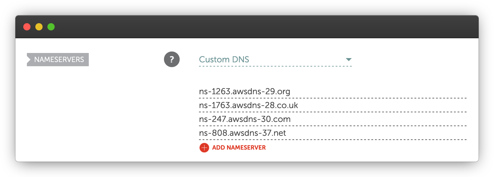
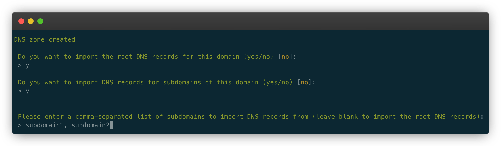

# DNS

## Why do you need a managed DNS?

Ymir uses AWS services that require specific DNS records as validation. Ymir will let you know whenever you need to create these validation records such as [when you use custom domain name][1] for your project. That said, if you're looking for a fully automated deployment experience, it's necessary that Ymir manage your DNS.

::: warning No email forwarding
Ymir doesn't currently support email forwarding with AWS. If your DNS provider does this for you, you'll have to migrate your email forwards to another service before using Ymir to manage your DNS.
:::

## Managing DNS zones

To have Ymir manage a domain for you, you need to create a [DNS zone][2] for that domain. A DNS zone manages all the DNS records for one domain. So you need to create one for each domain that you want Ymir to manage.

Now, you don't need to register a domain with [AWS Route53][3] to have Ymir manage it. When you create a DNS zone using the `dns:zone:create` command, the Ymir CLI will return the [name servers][4] for the created DNS zone. You can just edit the name servers on your [domain name's registar][5]. Below is how it's done with [Namecheap][6].



You can list all the DNS zones managed by Ymir with the `dns:zone:list` command. Whenever you don't need a DNS zone anymore, you can just delete it using the `dns:zone:delete` command.

## Importing DNS records

A difficult aspect of changing DNS providers is that your DNS records don't carry over to the new server. To help make the transition easier, Ymir has the ability to import DNS records from your previous DNS server.

Now, it's important to mention the limitation of the DNS record import. For security reasons, DNS servers don't allow you to query all the DNS records for a domain. You can only query for the records that match a name *exactly*.



This is why, when you create a new DNS zone, you'll get asked if you want to root DNS records for the domain. This is useful to import the [MX records][7] for your domain and other important DNS record. These are often at the root of your domain.

You'll then get asked if you want to import DNS records for subdomains. You can then supply all the subdomains to scan for DNS records to import. If you want to import more DNS records after creating your DNS zone, you can use the `dns:zone:import-records` command.

::: warning Import before switching name servers
You must import all the DNS records before switching your name servers to the ones for your new DNS zone.
:::

## Managing DNS records

You'll also want to add, update and delete DNS records in your DNS zone. First, you can view all the records in a DNS zone using the `dns:record:list` command. You can delete DNS records using the `dns:record:delete` command.

With the `dns:record:delete` command, you can use different options to filter the records that your want to delete. The available option filters are `--name`, `--type` and `--value`. If you already know the ID of the DNS record that you want to delete, you can pass it as a second argument.

```
$ ymir dns:record:delete domain.co.uk 42
$ ymir dns:record:delete domain.co.uk --type=A
$ ymir dns:record:delete domain.co.uk --name=www --type=A
$ ymir dns:record:delete domain.co.uk --name=www --type=A --value=127.0.0.1
```

::: warning Deleting all DNS records
If you don't specify filters or a record ID, the `dns:record:delete` command will delete all the records in the DNS zone.
:::

To modify a DNS record, you want to use the `dns:record:change` command. This command both creates and updates DNS records. If there's no DNS record for the given type and type, Ymir will create it. Otherwise, it'll update the existing record.

```
$ ymir dns:record:change domain.co.uk A www 127.0.0.1
$ ymir dns:record:change domain.co.uk MX @ "10 mail.domain.co.uk,20 mail2.domain.co.uk"
```

::: tip Use commas for multiple DNS records
Some records such as MX records have multiple records for the same type and name. To create multiple DNS records for the same type and name, you can use pass a comma separated list of values as shown above.
:::

[1]: ../projects/environments.md#additional-domain-names
[2]: https://en.wikipedia.org/wiki/DNS_zone
[3]: https://aws.amazon.com/route53/
[4]: https://en.wikipedia.org/wiki/Name_server
[5]: https://en.wikipedia.org/wiki/Domain_name_registrar
[6]: https://www.namecheap.com/
[7]: https://en.wikipedia.org/wiki/MX_record
