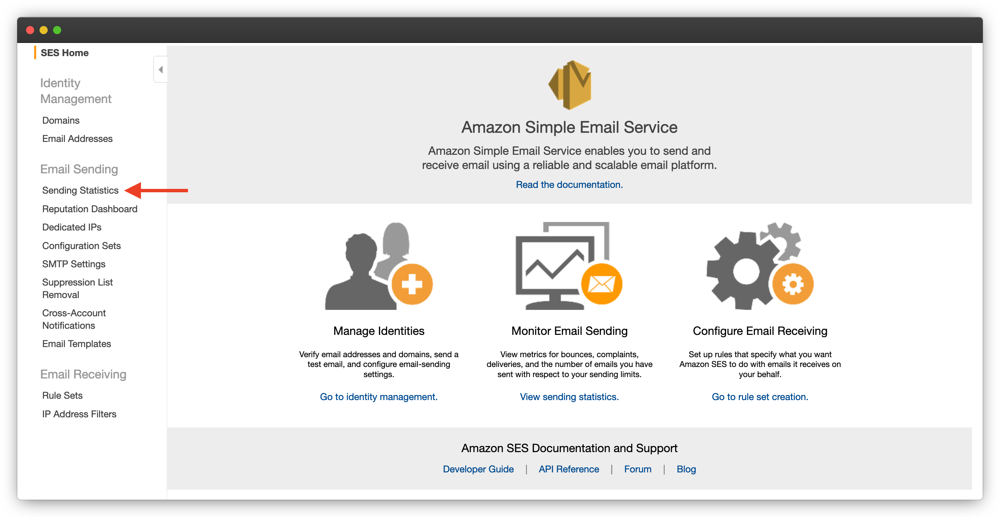
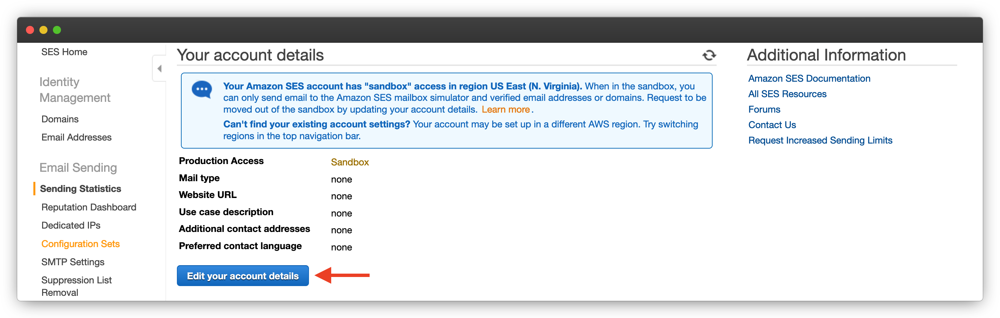
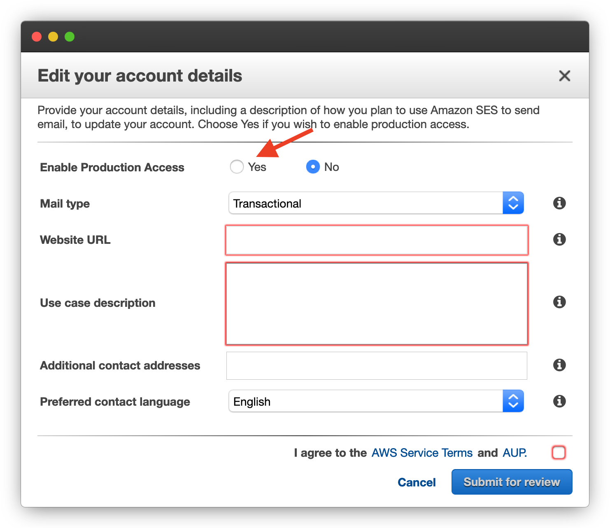
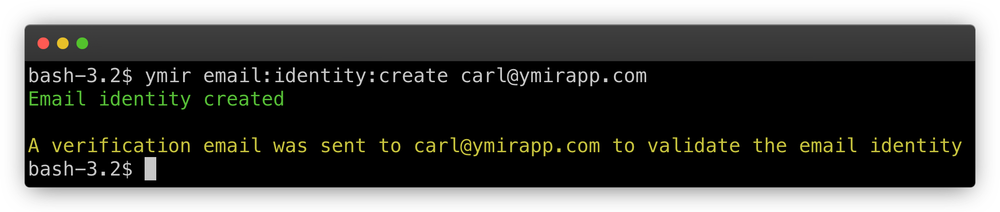

# Email

## How does email work with Ymir?

Because there are no servers to send emails from, all emails sent from your WordPress sites have to go through a transactional email service. The Ymir plugin automatically configures WordPress to send email through [AWS SES][1]. That said, there are a few things you need to do yourself to get up and running.

::: tip Disabing SES integration
Ymir doesn't require that you use SES as your transaction email service. If you're already using another service or even another SES plugin, you can disable Ymir's SES integration by defining the constant `YMIR_DISABLE_EMAIL_SENDING` as `true` in your `wp-config.php` file.
:::

## Getting your AWS account approved for sending email

Most transactional email services need to approve you before you can send emails. SES is no different. You need to get approved to send emails in eaca region you want to send emails from. To submit your account for approval, you need to go to [SES console][2].

Once there, you'll want to click on **Sending Statistics**. This will bring you to a page where you'll see that your account is currently in **sandbox** mode. You need to click on **Edit your account details** to start the approval process.

It's important to select **Yes** for **Enable Production Access** on this screen. This is what will allow you to send emails once you're approved.

But besides enabling production access, you also have to say what type of emails you want to send. You have the option for either transactional or marketing emails. Unless you WordPress site sends newsletters or other marketing material, you don't need to select marketing. You can keep it on transactional.

You'll also need to explain why you're sending email. Once that's done and you agreed too the terms, you can click **Submit for review**. You then have to wait for the approval process.

## Managing email identities

The other aspect of sending emails with SES is email identities. SES will only let you send emails with valid email identities. What is an email identity? It's a domain or email address that SES verified and approved for sending email.

::: danger Administration email
It's very important that the WordPress administration email (**Settings > General**) use an email address covered by an email identity. Otherwise, WordPress won’t be able to send critical email messages such as forgot password emails.
:::

Creating email identities is painless with the Ymir CLI. You can use the `email:identity:create` command to create an email identity. You can pass it a domain or an email address and it'll create the correct email identity for you.

To approve an email address, you just have to click a link that AWS sent at the email address. But if you want to create an email identity for a domain, you'll have to enter validation DNS records to get it approved. If [Ymir already manages the DNS][3] of that domain, you don't have to do anything. It'll automatically create the DNS records for you.

You can view all the email identities that Ymir manages with the `email:identity:list` command. To delete an email identity, you use the `email:identity:delete` command.

[1]: https://aws.amazon.com/ses/
[2]: https://console.aws.amazon.com/ses/home
[3]: ./dns.md
