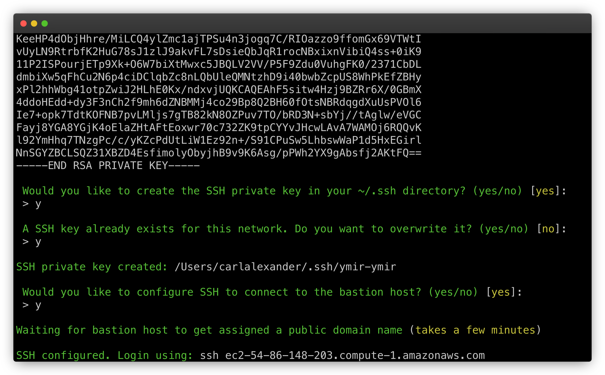

# Networks

## What are networks?

Some resources such as database servers cannot exist without a network. Whenever you create one such resource on a region without a network, Ymir will ask you to create one. For most, that will be the extent of their interaction with networks.

### Subnets

Ymir creates your network with a public and private [subnetwork][1] (also called subnet). A public subnet has access to the internet by default while a private one doesn't. If you want your private subnet to have access to the internet, you need to add a NAT gateway to the private subnet. This NAT gateway costs ~$32/month plus data transfer fees.

Because NAT gateways are so expensive, Ymir will try to use your public subnet by default. If you configure your project environment to use a private subnet resource such as a private database, Ymir will automatically add a NAT gateway to your network for you if there isn't one.

::: warning Not removed automatically
While Ymir will add a NAT gateway automatically, it won't remove it if you stop using a private subnet resource. You'll need to remove it using the `network:nat:remove` command. This is to prevent issues if you add custom private subnet resources that aren't managed by Ymir.
:::

## Managing networks

There are scenarios where you might want to create additional networks within the same region. You can use the `network:create` command to do so. You can also delete existing networks using the `network:delete` command.

### Connect a network to an environment

For similar reasons, you might want to connect a network to your project environment so that you can access private resources. To do so, add the `network` option to your environment configuration in the `ymir.yml` file. This will tell Ymir to connect that network to your environment during deployment.

```yml
id: 1
name: project-name
type: wordpress
environments:
  environment-name:
    network: network-name
```

::: warning Can create a NAT gateway
If the configured `network` doesn't have a NAT gateway, a NAT gateway will be configured during deployment.
:::

## Bastion host

If you want to access private subnet resources, you'll need a [bastion host][2] to do so. A bastion host is a small (`t3.nano`) SSH accessible EC2 instance that resides on your public subnet. You connect to it and then from there you can connect to resources on your private subnet.

You can add a bastion host to your network by using the `network:bastion:add` command. Once the bastion host created, the Ymir CLI will return the SSH private key used to connect to it.

If you're not comfortable with SSH, don't worry! The Ymir CLI will also offer to configure SSH for you. Once configured, you'll get the SSH command to connect to your bastion host.



If you're done with your bastion host, you can remove it with the `network:bastion:remove` command.

## NAT gateway

If you want to add custom private subnet resources such as ElasticSearch, you can manually add a NAT gateway to your network using the `network:nat:add` command. If you have no more private subnet resources, you can use the `network:nat:remove` command to remove the network's NAT gateway.

[1]: https://en.wikipedia.org/wiki/Subnetwork
[2]: https://en.wikipedia.org/wiki/Bastion_host
