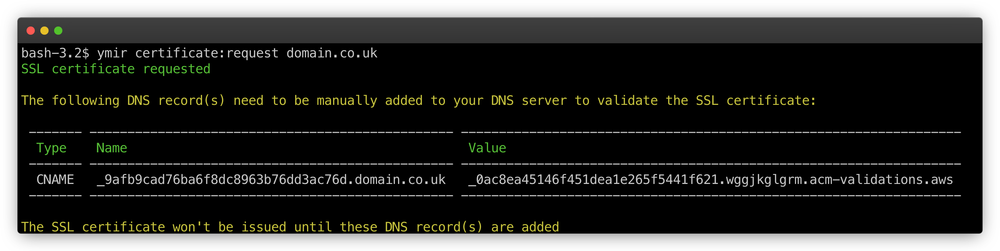

# SSL certificates

## Why do you need a SSL certificate?

SSL certificates are an essential element of hosting a WordPress site on AWS. A lot of AWS services require that you have a SSL certificate for the domain(s) mapped to it.

**If your WordPress site only uses a vanity domain or maps to domain(s) managed by Ymir, you don't have to worry about a SSL certificate.** Ymir will issue and attach the correct certificate for your WordPress site during deployment. This is why it's preferable for Ymir to manage your DNS.

If your project uses domains that aren't manage by Ymir, you need to ensure that you have a SSL certificate for those domains. **You will not be able to deploy your WordPress project if there's no issued SSL certificate for the domains that map to it.**

## Requesting a SSL certificate

To request a SSL certificate, you can use the `certificate:request` command.

```
$ ymir certificate:request domain.co.uk
```

A SSL certificate is only valid for a specific AWS region. By default, Ymir will create a SSL certificate in the project region. If you want to create a certificate in a different region, you can use the `--region` option.



Once Ymir requested the SSL certificate, it'll return DNS record(s) that you need to add to your DNS provider. AWS won't issue your SSL certificate until they're created. **You also won't be able to deploy your project until AWS issues the SSL certificate.**

## Managing your SSL certificate

You can view all your SSL certificates using the `certificate:list` command. You can also see which certificates are in use. This is important because you can only delete certificates if they aren't in use. To delete a certificate, you simply use the `certificate:delete` command.
